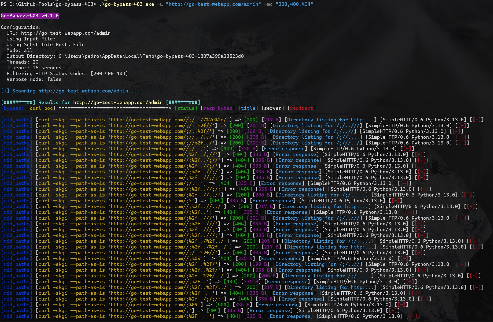

# Go-Bypass-403

A powerful WAF (HTTP 403/401) and URL parser bypass tool developed in Go, designed to preserve exact URL paths and structures during testing. Unlike Go's standard libraries, the tool enables true raw HTTP requests without any encoding or normalization, ensuring complete control over the request structure. This functionality is powered by a full-stack HTTP client, independent of Go's internals, and a custom URL parser.

## Features

- **Raw URL Preservation**: Unlike other Go tools that use the standard `net/url` package which automatically normalizes and encodes URLs, Go-Bypass-403 preserves the exact URL structure similar to curl's `--path-as-is` flag. This is crucial for WAF bypass attempts where path traversal and specific URL structures need to be maintained.

- **Custom URL Parser**: Implements a specialized URL parser that prevents Go's default security measures from interfering with bypass attempts. This allows for testing of edge cases and security boundaries that would otherwise be normalized away.

- **Multiple Bypass Techniques**: 
  - Path manipulation (mid-path, end-path)
  - Case substitution
  - Headers manipulation (IP, scheme, URL, port)
  - Character encoding variations
  - And more...

- **CDN Bypass Support**: Special features for testing CDN-based bypasses using host substitution

## Motivation

Traditional Go-based security tools often struggle with WAF bypasses because Go's standard libraries are designed to be secure by default, automatically normalizing URLs and encoding special characters. This makes it difficult to test certain types of bypasses that rely on specific URL structures or character sequences.

Go-Bypass-403 solves this by:
1. Using a custom URL parser that preserves raw paths
2. Implementing curl-like path preservation
3. Maintaining exact URL structures throughout the testing process
4. Allowing for true raw URL manipulation without automatic sanitization
5. The best similar tool that is publicly available was developed by [laluka](https://github.com/laluka) and can be found at the following URL: [bypass-url-parser](https://github.com/laluka/bypass-url-parser). It is written in Python, however, it uses curl for each bypass attempt, as curl supports `--path-as-is` to send raw payloads. Unfortunately, this tool is extremely slow because it uses curl to send the requests.
Quote from laluka:
> If you wonder why this code is nothing but a dirty curl wrapper, here's why:
>>    Most of the python requests do url/path/parameter encoding/decoding, and I hate this.
>>    If I submit raw chars, I want raw chars to be sent.
>>    If I send a weird path, I want it weird, not normalized.
>>
>This is surprisingly hard to achieve in python without losing all of the lib goodies like parsing, ssl/tls encapsulation and so on.
So, be like me, use curl as a backend, it's gonna be just fine.

# Installation

```bash
git clone https://github.com/slicingmelon/go-bypass-403.git
go get
go build .\cmd\go-bypass-403\
```

# Usage

```
Go-Bypass-403

Usage:
  -u, -url
        Target URL (example: https://cms.facebook.com/login)
  -l, -urls-file
        File containing list of target URLs (one per line)
  -shf, -substitute-hosts-file
        File containing a list of hosts to substitute target URL's hostname (mostly used in CDN bypasses by providing a list of CDNs)
  -m, -module
        Bypass module (all, mid_paths, end_paths, case_substitution, char_encode, http_headers_scheme, http_headers_ip, http_headers_port, http_headers_url, http_host) (Default: all)
  -o, -outdir
        Output directory
  -t, -threads
        Number of concurrent threads (Default: 15)
  -T, -timeout
        Timeout in seconds (Default: false)
  -delay
        Delay between requests in milliseconds (Default: 150)
  -v, -verbose
        Verbose output
  -d, -debug
        Debug mode with request canaries
  -trace
        Trace HTTP requests
  -mc, -match-status-code
        Only save results matching these HTTP status codes (example: -mc 200,301,500 or 'all' / '*', for any status code)
  -http2
        Enable HTTP2 client (Default: false)
  -x, -proxy
        Proxy URL (format: http://proxy:port) (Example: -x http://127.0.0.1:8080)
  -spoof-header
        Add more headers used to spoof IPs (example: X-SecretIP-Header,X-GO-IP)
  -spoof-ip
        Add more spoof IPs (example: 10.10.20.20,172.16.30.10)
  -fr, -follow-redirects
        Follow HTTP redirects
  -rbps, -response-body-preview-size
        Maximum number of bytes to retrieve from response body (Default: 512)
  -update-payloads
        Update payload files to latest version
```

## Standard WAF 403/401 Bypass

Standard command(s):
```bash
go-bypass-403 -u "https://go-test-webapp.com/admin" -mc "200"
go-bypass-403 -u "https://go-test-webapp.com/admin" -mc "200,500" -t 10 -v 
go-bypass-403 -u "https://go-test-webapp.com/admin" -mc "all" -t 10 -v 
```

Using a list of target URLs:
```bash
go-bypass-403 -l "targeturls.txt" 
```

## Find CDN Bypasses Using A List Of Hosts 

Sometimes you want to find bypasses in a long list of CDNs, and you know that the video path is always the same. Example when you want to bypass the hash check on a video or image.

// Redacted. Will update.

## Screenshots

Example Results 1



# Changelog

## 09 January 2025

- Refacted the entire codebase. Everything will be documented separately. 

## 05 November 2024

- First official release

## Credits


This tool was inspired by and based on [laluka's bypass-url-parser](https://github.com/laluka/bypass-url-parser). All credit for the original concept and bypass techniques goes to him.

Special thanks to [laluka](https://github.com/laluka) for open-sourcing his work and his vast bypass techniques implemented in his tool.

