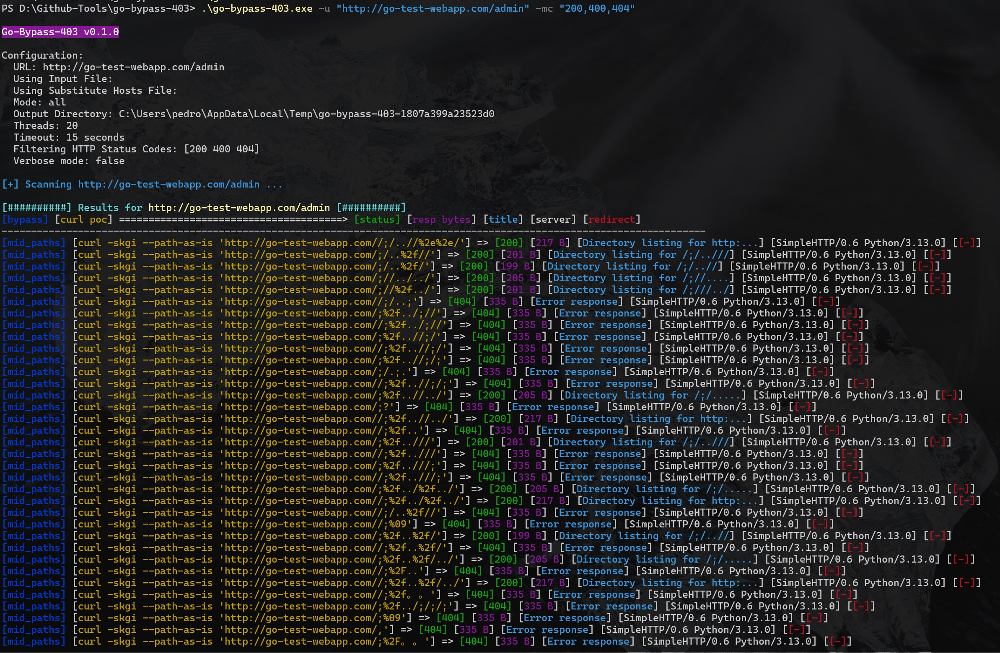
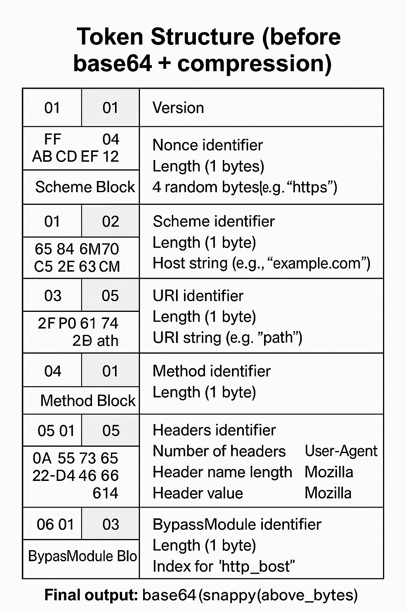

# GoByPASS403

A powerful WAF (HTTP 403/401) and URL parser bypass tool developed in Go, designed to preserve exact URL paths and structures during testing. Unlike Go's standard libraries, the tool enables true raw HTTP requests without any encoding or normalization, ensuring complete control over the request structure. This functionality is powered by a full-stack HTTP client, independent of Go's internals, and a custom URL parser.

## Author <!-- omit in toc -->

**slicingmelon**<br><br>
[](https://github.com/slicingmelon)<br>
[](https://x.com/pedro_infosec)

---

- [GoByPASS403](#gobypass403)
- [Features](#features)
- [Installation](#installation)
  - [Precompiled Binaries (Recommended)](#precompiled-binaries-recommended)
  - [Build Locally](#build-locally)
    - [Standard Build](#standard-build)
    - [GoReleaser](#goreleaser)
- [Usage](#usage)
  - [Standard WAF 403/401 Bypass](#standard-waf-403401-bypass)
  - [Find CDN Bypasses Using A List Of Hosts](#find-cdn-bypasses-using-a-list-of-hosts)
  - [Screenshots](#screenshots)
- [Bypass Modules](#bypass-modules)
  - [1. char\_encode](#1-char_encode)
  - [2. mid\_paths](#2-mid_paths)
  - [3. end\_paths](#3-end_paths)
  - [4. path\_prefix](#4-path_prefix)
  - [5. http\_methods](#5-http_methods)
  - [6. case\_substitution](#6-case_substitution)
  - [7. nginx\_bypasses](#7-nginx_bypasses)
  - [8. haproxy\_bypasses](#8-haproxy_bypasses)
    - [CVE-2021-40346: HTTP Request Smuggling via Integer Overflow](#cve-2021-40346-http-request-smuggling-via-integer-overflow)
    - [CVE-2023-45539: URL Fragment ACL Bypass](#cve-2023-45539-url-fragment-acl-bypass)
  - [9. unicode\_path\_normalization](#9-unicode_path_normalization)
  - [10. headers\_scheme](#10-headers_scheme)
  - [11. headers\_ip](#11-headers_ip)
  - [12. headers\_port](#12-headers_port)
  - [13. headers\_url](#13-headers_url)
  - [14. headers\_host](#14-headers_host)
- [Findings](#findings)
  - [Findings Summary](#findings-summary)
  - [Full Findings Database](#full-findings-database)
  - [Reproducing Findings](#reproducing-findings)
    - [Curl PoC Commands](#curl-poc-commands)
    - [Debug Token System](#debug-token-system)
      - [Token Structure](#token-structure)
      - [Debug Token Usage](#debug-token-usage)
      - [Token Storage and Access](#token-storage-and-access)
- [Changelog](#changelog)
- [Motivation](#motivation)
  - [Credits](#credits)

# Features

- **Raw URL Preservation**: Unlike other Go tools that use the standard `net/url` package which automatically normalizes and encodes URLs, GoBypass403 preserves the exact URL structure similar, even better than curl's `--path-as-is` or Burp Engine. This is crucial for WAF bypass attempts where path traversal and specific URL structures need to be maintained.

- **Custom URL Parser**: Implements a specialized URL parser that prevents Go's default security measures from interfering with bypass attempts. This allows for testing of edge cases and security boundaries that would otherwise be normalized away.

- **Multiple Bypass Techniques**: 
  - Path manipulation (mid-path, end-path)
  - Case substitution
  - Headers manipulation (IP, scheme, URL, port)
  - Character encoding variations
  - And more...

- **CDN Bypass Support**: Special features for testing CDN-based bypasses using host substitution

# Installation

## Precompiled Binaries (Recommended)

- Windows, Linux and MacOS builds available: https://github.com/slicingmelon/gobypass403/releases/latest.

## Build Locally

### Standard Build

```bash
git clone https://github.com/slicingmelon/gobypass403.git
go mod download
go build .\cmd\gobypass403\
```

### GoReleaser 

```bash
goreleaser build --snapshot --clean --single-target --output .
```

# Usage

```
GoByPASS403

Usage:
  -u, -url
        Target URL (example: https://cms.facebook.com/login)
  -l, -urls-file
        File containing list of target URLs (one per line)
  -shf, -substitute-hosts-file
        File containing a list of hosts to substitute target URL's hostname (mostly used in CDN bypasses by providing a list of CDNs)
  -m, -module
        Bypass module (all,path_prefix,mid_paths,end_paths,http_methods,case_substitution,char_encode,nginx_bypasses,haproxy_bypasses,unicode_path_normalization,headers_scheme,headers_ip,headers_port,headers_url,headers_host). Supports glob patterns with * (e.g., headers*,*bypass*) (Default: all)
  -em, -exclude-module
        Exclude specific bypass modules. Supports glob patterns with * (e.g., -em unicode*,*experimental). Takes precedence over -m
  -o, -outdir
        Output directory
  -cr, -concurrent-requests
        Number of max concurrent requests (Default: 15)
  -T, -timeout
        Total timeout (in milliseconds) (Default: 20000)
  -delay
        Delay between requests (in milliseconds) (0 means no delay) (Default: 0)
  -max-retries
        Maximum number of retries for failed requests (0 means no retries) (Default: 2)
  -retry-delay
        Delay between retries (in milliseconds) (Default: 500)
  -max-cfr, -max-consecutive-fails
        Maximum number of consecutive failed requests before cancelling the current bypass module (Default: 15)
  -at, -auto-throttle
        Enable automatic request throttling (on/off, 1/0) (Default: on)
  -v, -verbose
        Verbose output (Default: false)
  -d, -debug
        Debug mode with request canaries (Default: false)
  -mc, -match-status-code
        Filter results by HTTP status codes (example: -mc 200, 301, 5xx, all). Default: All status codes
  -mct, -match-content-type
        Filter results by content type(s) substring (example: -mct application/json,text/html)
  -min-cl, -min-content-length
        Filter results by minimum Content-Length (example: -min-cl 100)
  -max-cl, -max-content-length
        Filter results by maximum Content-Length (example: -max-cl 5000)
  -H, -header
        Custom HTTP header (example: -H "X-My-Header: value"), can be used multiple times
  -sc, -strict-scheme
        Only test URLs with the original scheme from input (prevents auto-expansion to http/https) (Default: false)
  -http2
        Enable HTTP2 client (Default: false)
  -x, -proxy
        Proxy URL (format: http://proxy:port) (Example: -x http://127.0.0.1:8080)
  -spoof-header
        Add more headers used to spoof IPs (example: X-SecretIP-Header,X-GO-IP)
  -spoof-ip
        Add more spoof IPs (example: 10.10.20.20,172.16.30.10)
  -fr, -follow-redirects
        Follow HTTP redirects
  -rbps, -response-body-preview-size
        Maximum number of bytes to retrieve from response body (Default: 1024)
  -drbs, -disable-response-body-streaming
        Disables streaming of response body (default: False) (Default: false)
  -dpb, -disable-progress-bar
        Disable progress bar (Default: false)
  -r, -resend
        Resend the exact request using the debug token (example: -r xyzdebugtoken)
  -rn, -resend-num
        Number of times to resend the debugged request (Default: 1)
  -profile
        Enable pprof profiler (Default: false)
  -update-payloads
        Update payload files to latest version (Default: false)
```

## Standard WAF 403/401 Bypass

Standard command(s):
```bash
gobypass403 -u "https://go-test-webapp.com/admin" -mc "200"
gobypass403 -u "https://go-test-webapp.com/admin" -mc "200,500" -cr 10
gobypass403 -u "https://go-test-webapp.com/admin" -mc "mid_paths,nginx_bypasses,headers_ip" -cr 20 -mct "application/json,image/png"
```

Using a list of target URLs:
```bash
gobypass403 -l "targeturls.txt" 
```

## Find CDN Bypasses Using A List Of Hosts 

Sometimes you want to find bypasses in a long list of CDNs, and you know that the video path is always the same. Example when you want to bypass the hash check on a video or image.

// Redacted. Will update.

## Screenshots

Example Results 1


# Bypass Modules

The next section describes each bypass module in detail. Each module implements a distinct set of techniques designed to uncover specific vulnerabilities in WAFs, ACLs, reverse proxies, and web server misconfigurations.

## 1. char_encode

The `char_encode` module implements comprehensive character encoding techniques to bypass WAF pattern matching. It systematically generates payloads by applying URL encoding using five distinct strategies.

The module implements five core encoding techniques:

1. **Last Character Encoding:** Encodes the last character of the entire path.
2. **First Character Encoding:** Encodes the first character of the path (after any leading '/').
3. **Last Segment Character Encoding:** Encodes each character in the last path segment individually.
4. **Full Path Character Encoding:** Encodes each character in the entire path individually.
5. **Full Segment Encoding Variations:** Encodes all characters within complete path segments, creating fully URL-encoded versions of each segment.

For each technique, it generates three encoding variants:
- Single encoding: `%61` (standard percent encoding)
- Double encoding: `%2561` (encoding the percent sign itself)
- Triple encoding: `%252561` (encoding the percent sign twice)

Example payloads for `https://example.com/admin/test`:

```
# Individual character encoding
/admin/test → /admi%6e/test     # Last character encoded
/admin/test → /%61dmin/test     # First character encoded  
/admin/test → /admin/t%65st     # Character in last segment encoded

# Full segment encoding  
/admin/test → /%61%64%6d%69%6e/test           # Full "admin" segment encoded
/admin/test → /admin/%74%65%73%74             # Full "test" segment encoded
/admin/test → /%61%64%6d%69%6e/%74%65%73%74   # Both segments fully encoded
```

All variations preserve the original query string if present. Special characters like `?` and `#` are handled with proper percent-encoding to preserve query parameters.

## 2. mid_paths

The `mid_paths` module injects path traversal sequences and special character combinations using a predefined list of payloads (`internal_midpaths.lst`).

For a URL like `/a/b`, the module creates these variants:

1. Before path:
   - `PAYLOAD/a/b`
   - `/PAYLOAD/a/b`

2. At each segment:
   - `/PAYLOADa/b` (fused with first segment start)
   - `/aPAYLOAD/b` (fused with first segment end)
   - `/a/PAYLOADb` (fused with second segment start)
   - `/a/bPAYLOAD` (fused with second segment end)

3. After each slash:
   - `/a/PAYLOAD/b` (inserted after a slash)

Each variant is generated with appropriate path normalization handling. The module carefully manages special characters in path segments, generating additional variants with percent-encoded `?` and `#` characters when necessary.

## 3. end_paths 

The `end_paths` module appends a variety of suffixes from a predefined list (`internal_endpaths.lst`) to the end of the URL path. This technique targets path normalization vulnerabilities and extension handling issues in WAFs.

For a URL like `https://example.com/admin`, the module generates:

1. Standard suffix variants:
   - `/admin/SUFFIX`
   - `/admin/SUFFIX/`

2. Direct append variants (when the base path isn't root `/` and suffix doesn't start with a letter):
   - `/adminSUFFIX`
   - `/adminSUFFIX/`

Common suffixes include:
- Path traversal sequences: `..;/`, `../`, `./`
- Special characters: `;`, `:`, `%20`
- Common extensions: `.json`, `.php~`, `.bak`

The module preserves the original query string and handles special characters with proper percent-encoding to maintain request integrity.

## 4. path_prefix

The `path_prefix` module manipulates path segments using specific byte patterns to bypass security checks. It systematically prefixes URL segments with ASCII control characters, special characters, and the literal 'x' character.

For each relevant byte value, the module creates three distinct variations:

1. Dummy Segment Prefix (Single Byte):
   - Adds a new first segment containing the byte value
   - Example: `/admin` → `/[b1]/admin` or `/%XX/admin`

2. Existing Segment Prefix (Single Byte):
   - Prepends the byte to each existing segment individually
   - Example: `/admin/login` → `/[b1]admin/login` or `/%XXadmin/login`

3. Existing Segment Prefix (Two Bytes):
   - Prepends byte pairs to each existing segment
   - Example: `/admin/login` → `/[b1b2]admin/login` or `/%XX%YYadmin/login`

Each byte value is applied both as a raw byte (when safe) and in percent-encoded form to ensure maximum coverage of potential bypass vectors.

## 5. http_methods 

The `http_methods` module tests various standard and non-standard HTTP methods loaded from a predefined list (`internal_http_methods.lst`). HTTP method switching is a well-known technique to bypass WAF rules that only filter specific methods.

For each method, it generates:

1. Base method variation:
   - Uses the specified method with the original URL's path and query string
   - Example: `OPTIONS /admin` instead of `GET /admin`

2. Content-Length handling:
   - For methods that typically expect a body (POST, PUT, PATCH, DELETE), adds `Content-Length: 0` header
   - Example: `GET /admin` with `Content-Length: 0`

3. Query parameter relocation (POST only):
   - For POST requests with query parameters, creates a variant where:
     - Query string is removed from URL
     - Parameters are moved to the request body
     - Proper content type headers are set
   - Example: `POST /admin?id=1` becomes `POST /admin` with body `id=1`

## 6. case_substitution 

The `case_substitution` module applies targeted case manipulations to bypass case-sensitive pattern matching in WAFs and ACLs.

It implements four distinct case manipulation strategies:

1. Terminal character case inversion:
   - Uppercases only the last letter of the path (if lowercase)
   - Example: `/admin` → `/admiN`

2. HTTP method case manipulation:
   - Uppercases the HTTP method (e.g., "GET", "POST")
   - Example: `get /admin` → `GET /admin`

3. Character-by-character case inversion:
   - Inverts the case of each letter in the path individually
   - Example: `/admin` → `/Admin`, `/aDmin`, `/adMin`, `/admIn`, etc.

4. Full path uppercase conversion:
   - Uppercases the entire path string
   - Example: `/admin` → `/ADMIN`

All original query parameters are preserved when applying these case manipulations.

## 7. nginx_bypasses

The `nginx_bypasses` module is a comprehensive collection of techniques targeting server-side parsing inconsistencies across multiple web frameworks and server types. While named for Nginx, it targets a broad spectrum of platforms including Flask, Spring Boot, and Node.js applications.

The module implements several specialized bypass vectors:

1. Framework-specific byte patterns:
   - Flask bypasses: Bad bytes used in payloads (`0x85, 0xA0, 0x1F, 0x1E, 0x1D, 0x1C, 0x0C, 0x0B`) that can trigger path normalization bypasses
   - Spring Boot bypasses: Leverages tab character (`0x09`) and semicolon (`;`) interpretation quirks
   - Node.js bypasses: Exploits specific characters (`0xA0, 0x09, 0x0C`) that Node.js processes differently

2. Strategic character insertion:
   - Inserts both raw and percent-encoded special bytes in key positions:
     - Path end: `/admin[char]`
     - After trailing slash: `/admin/[char]`
     - Path beginning: `/[char]admin`
     - After each segment: `/segment1[char]/segment2`
     - Before each segment: `/segment1/[char]segment2`
     - After first character: `/s[char]egment1`

3. Request splitting techniques:
   - HTTP protocol confusion with newlines: 
     - Injects `%0A` followed by HTTP version strings (`HTTP/1.1`, `HTTP/1.0`, `HTTP/2.0`, `HTTP/0.9`)
     - Example: `/admin%0AHTTP/1.1`

4. Routing manipulation attacks:
   - Complex request smuggling vectors:
     - Combines newlines, HTTP versions, and alternative URIs
     - Example: `/admin%0AHTTP/1.1%0Ahttp://localhost/admin`
   - Host variation:
     - Tests multiple alternative hosts: `localhost`, `127.0.0.1` with different port combinations
     - Combines with explicit Host header manipulation

5. Protocol handler exploitation:
   - Tests different URI schemes (`http://`, `https://`, `file://`, `gopher://`)
   - Targets proxy pass-through vulnerabilities and protocol handler misconfigurations

The module represents one of the most comprehensive path manipulation testing suites, targeting inconsistencies in:
- HTTP request parsing
- Proxy handling
- Framework-specific path normalization
- Reverse proxy configurations
- Load balancer behavior
- Server-side protocol handling

Each payload is carefully generated to preserve proper URL structure and ensure the original query parameters are correctly maintained.

The sample screenshots below show ambiguous requests generated by the nginx_bypasses module:


## 8. haproxy_bypasses

The `haproxy_bypasses` module targets specific vulnerabilities in HAProxy configurations, implementing exploitation techniques for two critical CVEs that affect different versions and functionalities of HAProxy.

### CVE-2021-40346: HTTP Request Smuggling via Integer Overflow

This vulnerability exploits an integer overflow in HAProxy's header parsing mechanism to achieve HTTP Request Smuggling, allowing attackers to bypass access controls and routing restrictions.

**Attack Mechanism:**
- Creates malformed `Content-Length` headers with 256+ character names (e.g., `Content-Length0aaa...`)
- Exploits integer overflow in header parsing to smuggle secondary HTTP requests
- Uses public endpoints as camouflage while targeting restricted paths in the smuggled request

**Payload Structure:**
```
POST /public HTTP/1.1
Host: target.com
Content-Length0aaaa...[252 more 'a' chars]: 
Content-Length: 89
Connection: close

GET /admin HTTP/1.1
h:GET /public HTTP/1.1
Host: target.com

```

**Key Features:**
- Tests multiple public endpoints (`/`, `/robots.txt`, `/favicon.ico`, etc.) as entry points
- Each payload is sent twice in sequence (required for smuggling to work)
- Targets backend servers that process smuggled requests differently than HAProxy

### CVE-2023-45539: URL Fragment ACL Bypass

This vulnerability exploits HAProxy's improper handling of URL fragments (`#`) in Access Control List (ACL) matching, allowing attackers to bypass `path_end`, `path_beg`, and `path_reg` rules.

**Attack Vectors:**

1. **Extension Bypass (`path_end` rules):**
   ```
   /admin#.png          # Bypasses path_end .png rules
   /restricted#.css     # Bypasses path_end .css rules
   /api/secret#.json    # Bypasses path_end .json rules
   ```

2. **Path Prefix Bypass (`path_beg` rules):**
   ```
   /admin#public        # Bypasses path_beg public rules
   /restricted#guest    # Bypasses path_beg guest rules
   /api/private#api     # Bypasses path_beg api rules
   ```

3. **Multi-level Fragment Injection:**
   ```
   /api/v1#.xml/users   # Fragment injection between path segments
   /admin#static/panel  # Complex routing manipulation
   ```

4. **Advanced Techniques:**
   - Double fragment bypass: `/admin#public#.png`
   - Query parameter interference: `/admin#.css?debug=true`
   - Path traversal combinations: `/admin#../file.txt`

**Vulnerability Context:**
According to the [HAProxy changelog](https://www.mail-archive.com/haproxy%40formilux.org/msg43861.html), this vulnerability was reported by Seth Manesse and Paul Plasil. The issue allows requests like `index.html#.png` to match ACL rules checking for `path_end .png`, leading to incorrect routing decisions.

**Impact:**
- Bypasses WAF filtering rules based on file extensions
- Circumvents routing logic that relies on path matching
- Exploits inconsistencies between HAProxy's path parsing and ACL evaluation

**References:**
- [CVE-2021-40346 Analysis](https://jfrog.com/blog/critical-vulnerability-in-haproxy-cve-2021-40346-integer-overflow-enables-http-smuggling/)
- [CVE-2023-45539 Technical Details](https://www.haproxy.com/blog/december-2023-cve-2023-45539-haproxy-accepts-as-part-of-the-uri-component-fixed)
- [HAProxy 2.8.2 Security Update](https://www.mail-archive.com/haproxy%40formilux.org/msg43861.html)
- [PoC Playground](https://github.com/slicingmelon/HAProxy-CVE-2023-45539-PoC)

The module generates comprehensive payloads for both vulnerabilities, with CVE-2021-40346 typically producing ~14 HTTP smuggling variations and CVE-2023-45539 generating 150+ fragment-based bypass attempts targeting different ACL patterns and injection points.

## 9. unicode_path_normalization 

The `unicode_path_normalization` module generates payloads using Unicode character variants that normalize to standard ASCII characters, targeting systems that perform Unicode normalization during request processing. The module uses `unicode_char_map.json` which contains mappings from ASCII to Unicode characters that normalize to the original ASCII character.

The module implements five core bypass techniques:

1. **Double Slash Variations:**
   - Inserts extra slashes at path separator positions (e.g., `/admin//login`)
   - Creates variants where all slashes are doubled (e.g., `//admin//login`)

2. **Full Path Character Variations:**
   - Replaces path characters with Unicode equivalents systematically
   - Tests single occurrence and all occurrence replacements
   - Generates three forms for each replacement:
     - Raw Unicode: `/admin/logＥn`
     - URL-encoded: `/admin/log%EF%BC%A5n` 
     - UTF-8 bytes: `/admin/log\\xEF\\xBC\\xA5n`

3. **Path Segment Character Variations:**
   - Targets individual path segments (e.g., `admin`, `login`)
   - Systematically replaces first and last characters in segments
   - Replaces each character in segments one by one (limited to prevent explosion)

4. **Unicode Slash Insertion:**
   - Uses Unicode equivalents of slash character (`/`)
   - Inserts them next to existing slashes: `/admin/（unicode_slash）login`
   - Tests raw Unicode, URL-encoded, and UTF-8 byte forms

5. **Full Segment Unicode Variations:**
   - Creates completely Unicode-fied versions of path segments
   - Example: `/admin` → `/ªᵈᵐᵢⁿ` (raw) or `/%C2%AA%E1%B5%88%E1%B5%90%E1%B5%A2%E2%81%BF` (encoded)
   - Generates payloads replacing individual segments and all segments at once

All variations preserve the original query string if present. This module is effective against systems where Unicode normalization occurs after initial WAF validation, allowing Unicode variants to bypass pattern matching before being normalized to their ASCII equivalents during processing.

## 10. headers_scheme 

The `headers_scheme` module tests protocol-based bypasses using custom HTTP headers that indicate the original protocol or request scheme. Many applications rely on these headers for internal routing decisions and security policies.

The module operates by:

1. Reading two predefined lists:
   - `header_proto_schemes.lst`: Common headers for protocol indication
   - `internal_proto_schemes.lst`: Various protocol schemes to test (http, https, etc.)

2. Generating scheme-based payloads in three categories:
   - Standard protocol indicators: Pairs most headers with each protocol scheme
   - HTTPS-specific flags: Sets headers like `Front-End-Https`, `X-Forwarded-HTTPS`, and `X-Forwarded-SSL` to `on`
   - Forwarded header (RFC 7239): Uses the standardized format `proto={scheme}`

These headers exploit common misconfigurations in:
- Reverse proxies that don't properly validate or sanitize forwarded scheme information
- Load balancers that trust scheme headers for SSL/TLS decisions
- Web applications that use scheme headers for conditional logic or URL construction

## 11. headers_ip

The `headers_ip` module is a powerful IP spoofing toolkit that exploits how servers trust client-reported IP addresses for access control decisions. This often-overlooked bypass technique can circumvent WAF restrictions by manipulating IP-based trust relationships.

Key capabilities include:

1. Comprehensive header coverage:
   - Tests all industry-standard IP reporting headers:
     - `X-Forwarded-For`: The de-facto standard for client IP behind proxies
     - `X-Real-IP`: Used by Nginx and many CDNs for original client IP
     - `X-Client-IP`: Common in enterprise environments
     - `X-Originating-IP`: Used by Microsoft products and services
     - Dozens of additional vendor-specific headers from `header_ip_hosts.lst`

2. Multi-source IP data collection:
   - Dynamic IP reconnaissance at runtime - automatically caches all resolved IPs, CNAMEs, and DNS records
   - Predefined IP address lists from `internal_ip_hosts.lst` targeting internal/trusted networks
   - Custom IP specification via `-spoof-ip` CLI flag (comma-separated values)
   - Focus on high-value targets: localhost, internal networks, cloud metadata IPs

3. Advanced header manipulation:
   - Custom header support via `-spoof-header` CLI flag for targeting specific environments
   - Tests both original and normalized (canonicalized) forms of headers
   - RFC 7239 Forwarded header with parameter variations: `by=`, `for=`, and `host=`
   - Special-case bypasses like `X-AppEngine-Trusted-IP-Request: 1`

This technique exploits fundamental architectural weaknesses in:
- Multi-tier architectures where trust is established between components
- IP-based access control lists (ACLs) for admin interfaces
- Cloud environments that trust specific internal IPs
- WAFs that exempt traffic from certain source addresses
- Load balancers that make routing decisions based on client IP

## 12. headers_port

The `headers_port` module manipulates port-related HTTP headers to bypass security controls that make routing or access decisions based on the originating port.

The module works by:

1. Key port-related headers:
   - `X-Forwarded-Port`: Most widely recognized port header
   - `X-Port`: Direct port specification
   - `Port`: Simple port header
   - CDN-specific variants like `Cdn-Server-Port` and `Cdn-Src-Port`
   - Additional headers from `header_ports.lst`

2. Strategic port values:
   - Standard web ports: `80`, `443`
   - Alternative web ports: `8080`, `8443`, `3000`
   - Less common service ports: `5000`, `5001`, `9080`, `9443`
   - All values loaded from `internal_ports.lst`

Example bypass combinations:
```
X-Forwarded-Port: 8080
X-Port: 443
Cdn-Src-Port: 9000
X-Protocol-Port: 80
```

This technique is particularly effective against:
- Web application firewalls with port-specific filtering rules
- Load balancers that route based on original client port
- Microservice architectures with port-based service routing
- Security controls that exempt traffic from specific trusted ports

## 13. headers_url

The `headers_url` module implements URL path injection techniques through custom headers, targeting web applications and proxies that use header values for internal routing decisions.

Critical headers exploited include:

1. Primary routing headers:
   - `X-Original-URL`: Used by many WAFs and proxies for URL rewriting
   - `X-Rewrite-URL`: Common in Nginx configurations
   - `X-Override-URL`: Used in various proxy setups
   - `X-Forwarded-URI`: Often trusted by load balancers
   - `Base-URL`: Used in some legacy applications

2. Strategic path injection techniques:
   - Root URI injection: Sets request path to `/` while placing actual target path in headers
   - Parent path traversal: Tests all parent directories of target path
   - Full URL injection: Supplies complete URLs in headers for URL-aware headers
   - Mixed URL/path formats: Creates variations with different formatting and encoding

3. CVE-2025-29927 exploitation:
   - Targets Next.js middleware bypass via the critical `x-middleware-subrequest` header
   - Generates values like `middleware`, `middleware:middleware:middleware`, etc.
   - Creates variations with `src/middleware` prefix

Example bypasses:
```
GET / HTTP/1.1
Host: example.com
X-Original-URL: /admin

GET / HTTP/1.1
Host: example.com
X-Rewrite-URL: /api/users

GET /api/public/data HTTP/1.1
Host: example.com
X-Override-URL: /api/private/data

GET /api/products HTTP/1.1
Host: example.com
x-middleware-subrequest: middleware:middleware:middleware
```

This technique is especially effective against:
- Misconfigured reverse proxies and API gateways
- Web application firewalls with URL-rewriting capabilities
- Cloud-based WAF solutions that process headers before routing requests
- Next.js applications vulnerable to middleware bypasses

## 14. headers_host

The `headers_host` module exploits discrepancies between URL hostname and Host header processing, leveraging real-time reconnaissance data to generate targeted bypass attempts.

Key features include:

1. Dynamic reconnaissance integration:
   - Utilizes the tool's built-in recon cache that collects IP addresses and CNAMEs for target hosts
   - Automatically generates payloads based on discovered network topology
   - Supports both IPv4 and IPv6 address variations

2. IPv4/IPv6 service variations:
   - For each discovered IP (with scheme and port):
     - Uses IP as URL host with original hostname in Host header
     - Uses original hostname in URL with IP in Host header
   - Handles port specifications appropriately (default ports vs. explicit ports)
   - Creates IPv6-specific variants with proper bracket notation ([IPv6]:port)

3. CNAME-based bypass techniques:
   - Uses discovered canonical names from DNS reconnaissance
   - Four strategic variations for each CNAME:
     - Original URL + CNAME in Host header
     - CNAME as URL host + original hostname in Host header
     - CNAME in both URL host and Host header
     - Recursive domain suffix testing (e.g., sub.domain.com → domain.com)

This module is especially powerful for:
- Content Delivery Network (CDN) bypass attempts
- Virtual host confusion attacks
- DNS-based access control evasion
- Load balancer and reverse proxy misconfigurations

# Findings

## Findings Summary

When GoBypass403 completes a scan, it displays a comprehensive summary table showing all successful bypass attempts. The results are intelligently grouped and organized for easy analysis:

- **Grouping Logic**: Results are grouped by bypass module → status code → content length
- **Result Limiting**: Maximum 5 results per group to maintain readability
- **Table Format**: Displays module name, curl command (truncated), HTTP status, content length, content type, page title, and server information
- **Visual Separation**: Groups are separated with dotted lines for better visual organization

The summary table provides a quick overview of successful bypasses, allowing security testers to immediately identify which techniques worked and prioritize further investigation.

## Full Findings Database

All scan results are stored in a local SQLite database containing detailed information about every bypass attempt:

**Stored Data Per Request**:
- **Target details**: Original URL, bypass module used, scan timestamp
- **Response metrics**: HTTP status code, content length, response time
- **Content analysis**: Response headers, body preview, content type, page title, server information
- **Reproduction data**: Curl PoC command and debug token
- **Redirect tracking**: Redirect URLs if applicable

**Why SQLite?** Given that comprehensive bypass testing can generate hundreds or thousands of requests, storing everything in a structured database allows for:
- Efficient querying and filtering of results
- Persistent storage of all attempt details
- Advanced analysis using SQL queries
- Integration with external tools and scripts

**Accessing Full Data**: Use any SQLite browser/GUI tool (like DB Browser for SQLite, DBeaver, or SQLiteStudio) to explore the complete dataset, run custom queries, and perform detailed analysis of all bypass attempts.

## Reproducing Findings

### Curl PoC Commands

Every successful bypass attempt includes a ready-to-use curl command that exactly replicates the request. Example below:

```bash
curl -X POST "https://target.com/admin" -H "X-Forwarded-For: 127.0.0.1"
```

These curl commands are:
- **Exact replicas** of the successful bypass requests
- **Immediately executable** for manual verification
- **Stored in both** the summary table and SQLite database
- **Properly escaped** and formatted for shell execution

### Debug Token System

GoBypass403 implements a custom, complex debug token system for precise request reproduction and analysis.

Each payload generates a unique debug token that serves as a compressed fingerprint of the entire request. The token generation process:

1. **Seed-Based Generation**: Every payload gets a unique 4-byte random nonce
2. **Comprehensive Encoding**: Captures all request components (method, headers, body, URL, etc.)
3. **Efficient Compression**: Uses Snappy compression + Base64 encoding
4. **Indexed Optimization**: Common HTTP methods and bypass modules use byte indices instead of full strings

#### Token Structure

```
[Version][Nonce][Scheme][Host][URI][Method][Headers][BypassModule][Body]
│    1B  │  6B  │  Var │ Var │Var│  Var  │   Var   │     Var     │ Var │
```

- **Version** (1 byte): Token format version
- **Nonce** (6 bytes): Unique 4-byte random identifier + length prefix
- **Variable Fields**: All request components with length prefixes
- **Final Encoding**: `base64(snappy(raw_bytes))`



#### Debug Token Usage

**For Request Reproduction** (`-r` flag):
```bash
./gobypass403 -r "eyJhbGciOiJIUzI1NiIsInR5cCI6IkpXVCJ9..."
```

**In Debug Mode** (`-d` flag):
```bash
./gobypass403 -u https://target.com/admin -d
```
When debug mode is enabled, each HTTP request also includes the debug token as a custom header, making it visible in request logs and easier to correlate with results.

**Token Decoding Process**:
1. Base64 decode the token string
2. Snappy decompress the bytes
3. Parse the structured binary format
4. Reconstruct the exact original request
5. Execute the request with identical parameters

#### Token Storage and Access

- **SQLite Database**: All debug tokens are stored in the `debug_token` column
- **Exclusive Storage**: Debug tokens are ONLY available in the SQLite database (not in terminal output)
- **Persistent Access**: Tokens remain available for reproduction even after scan completion
- **Query Support**: Use SQL queries to find tokens based on status codes, modules, or other criteria

Example SQL query to find debug tokens:
```sql
SELECT debug_token, curl_cmd, status_code 
FROM scan_results 
WHERE status_code = 200 AND bypass_module = 'headers_ip';
```

This debug token system enables precise request reproduction, detailed analysis, and integration with other security testing workflows.

# Changelog

Full changelog at [CHANGELOG](./CHANGELOG.md).

# Motivation

Traditional Go-based security tools often struggle with WAF bypasses because Go's standard libraries are designed to be secure by default, automatically normalizing URLs and encoding special characters. This makes it difficult to test certain types of bypasses that rely on specific URL structures or character sequences.

Go-Bypass-403 solves this by:
1. Using a custom URL parser that preserves raw paths
2. Implementing curl-like path preservation
3. Maintaining exact URL structures throughout the testing process
4. Allowing for true raw URL manipulation without automatic sanitization
5. The best similar tool that is publicly available was developed by [laluka](https://github.com/laluka) and can be found at the following URL: [bypass-url-parser](https://github.com/laluka/bypass-url-parser). It is written in Python, however, it uses curl for each bypass attempt, as curl supports `--path-as-is` to send raw payloads. Unfortunately, this tool is extremely slow because it uses curl to send the requests.
Quote from laluka:
> If you wonder why this code is nothing but a dirty curl wrapper, here's why:
>>    Most of the python requests do url/path/parameter encoding/decoding, and I hate this.
>>    If I submit raw chars, I want raw chars to be sent.
>>    If I send a weird path, I want it weird, not normalized.
>>
>This is surprisingly hard to achieve in python without losing all of the lib goodies like parsing, ssl/tls encapsulation and so on.
So, be like me, use curl as a backend, it's gonna be just fine.

## Credits


This tool was inspired by and based on [laluka's bypass-url-parser](https://github.com/laluka/bypass-url-parser). All credit for the original concept and bypass techniques goes to him.

Special thanks to [laluka](https://github.com/laluka) for open-sourcing his work and his vast bypass techniques implemented in his tool.


This project is licensed under the [MIT License](LICENSE).