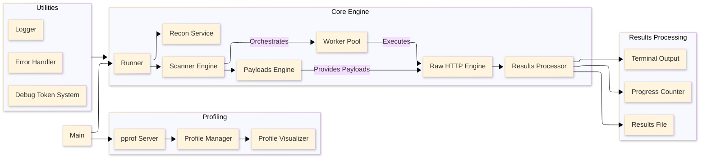

# Go Bypass 403 - Flow Architecture

## High Level Diagram



# Command Line Interface (CLI Layer)

This section outlines every available option, grouped by function, to provide clarity for developers and end users.

## Overview

- Input processing: Accepts either a single target URL or a file of URLs.
- Module configuration: Allows selection of one or more bypass techniques.
- Network configuration: Supports proxies, custom header & IP spoofing, and additional network-level options.
- Output/results management: Configures directories and logging.
- Advanced control: Facilitates profiling, debug mode, and request replay via debug tokens.

## Usage Syntax

```bash
Go-Bypass-403

Usage:
  -u, -url
        Target URL (example: https://cms.facebook.com/login)
  -l, -urls-file
        File containing list of target URLs (one per line)
  -shf, -substitute-hosts-file
        File containing a list of hosts to substitute target URL's hostname (mostly used in CDN bypasses by providing a list of CDNs)
  -m, -module
        Bypass module (all, mid_paths, end_paths, case_substitution, char_encode,unicode_path_normalization, http_headers_scheme, http_headers_ip, http_headers_port, http_headers_url, http_host) (Default: all)
  -o, -outdir
        Output directory
  -t, -threads
        Number of concurrent threads (Default: 15)
  -T, -timeout
        Total timeout (in milliseconds) (Default: 20000)
  -delay
        Delay between requests (in milliseconds) (0 means no delay) (Default: 0)
  -max-retries
        Maximum number of retries for failed requests (0 means no retries) (Default: 2)
  -retry-delay
        Delay between retries (in milliseconds) (Default: 500)
  -max-cfr, -max-consecutive-fails
        Maximum number of consecutive failed requests before cancelling the current bypass module (Default: 15)
  -at, -auto-throttle
        Enable automatic request throttling (on/off, 1/0) (Default: on) (Default: on)
  -v, -verbose
        Verbose output (Default: false)
  -d, -debug
        Debug mode with request canaries (Default: false)
  -mc, -match-status-code
        Filter results by HTTP status codes (example: -mc 200, 301, 500, all). Default: All status codes
  -mct, -match-content-type
        Filter results by content type(s) substring (example: -mct application/json,text/html)
  -http2
        Enable HTTP2 client (Default: false)
  -x, -proxy
        Proxy URL (format: http://proxy:port) (Example: -x http://127.0.0.1:8080)
  -spoof-header
        Add more headers used to spoof IPs (example: X-SecretIP-Header,X-GO-IP)
  -spoof-ip
        Add more spoof IPs (example: 10.10.20.20,172.16.30.10)
  -fr, -follow-redirects
        Follow HTTP redirects
  -rbps, -response-body-preview-size
        Maximum number of bytes to retrieve from response body (Default: 1024)
  -drbs, -disable-response-body-streaming
        Disables streaming of response body (default: False) (Default: false)
  -dpb, -disable-progress-bar
        Disable progress bar (Default: false)
  -r, -resend
        Resend the exact request using the debug token (example: -r xyzdebugtoken)
  -rn, -resend-num
        Number of times to resend the debugged request (Default: 1) (Default: 1)
  -profile
        Enable pprof profiler (Default: false)
  -update-payloads
        Update payload files to latest version (Default: false)
```

### Usage Examples

```bash
gobypass403 -u "https://cms.example.com/login" -m all -t 20
gobypass403 -u "https://forbiddenwebapp.com/admin" -m mid_paths,end_paths, -mc "200,301,302,500"
gobypass403 -u "https://forbiddenwebapp.com/secret" -m mid_paths,end_paths, -mc "500" -mct "text/html,image/png" 
```

## CLI Options

3.1. Input Options
Target URL
-u, --url

The target URL for scanning (e.g., https://cms.facebook.com/login).

Target URL File
-l, --urls-file

Path to a file containing one target URL per line. Note: Cannot be used simultaneously with the single URL option.

Substitute Hosts File
-shf, --substitute-hosts-file

Specifies a file containing alternative hostnames. This option requires a single target URL (using -u) and cannot be combined with URL file input.

3.2. Bypass Modules & Scan Configuration
Bypass Module(s)
-m, --module

Comma-separated list of bypass modules. Supported modules:

```
dumb_check
mid_paths
end_paths
case_substitution
char_encode
http_headers_scheme
http_headers_ip
http_headers_port
http_headers_url
http_host
unicode_path_normalization
```

The keyword all expands to all available modules (except for dumb_check, which is prepended by default).

Threads 
Number of concurrent threads to use; defaults to 15.

```bash
-t, --threads
```


Timeout
-T, --timeout

Total request timeout in milliseconds (default is 20,000 ms).

Delay Between Requests
--delay

Delay (in milliseconds) between consecutive requests (default is 0, meaning no delay).

Maximum Retries & Retry Delay
--max-retries and --retry-delay

Maximum retries for failed requests (default: 2) and the delay between retries (default: 500 ms).

Maximum Consecutive Failures
--max-cfr, --max-consecutive-fails

Defines after how many consecutive failed attempts a bypass module should cancel (default: 15).

Automatic Request Throttling
-at, --auto-throttle

Enables or disables auto-throttling of requests. Accepted values: on/off, 1/0, true/false (default: on).

3.3. Network & Proxy Options
Proxy
-x, --proxy

Proxy server URL, e.g., http://127.0.0.1:8080.

Spoof IP / Header
--spoof-ip and --spoof-header

Custom IP addresses and headers for IP spoofing experiments.

HTTP2 Support
--http2

Flag to enable HTTP2 functionality (currently a placeholder awaiting further implementation).

Follow HTTP Redirects
--fr, --follow-redirects

Determines whether to follow HTTP redirects (reserved for future enhancements).

3.4. Response & Output Options
Output Directory
-o, --outdir

Sets the directory for storing scan outputs and results. Defaults to a uniquely generated temporary directory.

Response Body Preview Size
--rbps, --response-body-preview-size

Maximum number of bytes to retrieve from the response body (default: 1024 bytes).

Disable Response Body Streaming
--drbs, --disable-response-body-streaming

Disables streaming response bodies—for use cases where only headers and small previews are required.

Disable Progress Bar
--dpb, --disable-progress-bar

Turns off the real-time progress bar when desired.

Verbose Output
-v, --verbose

Provides extended log information on the console.

3.5. Debug & Profiling
Debug Mode
-d, --debug

Activates debug mode, which includes detailed request tracking via a debug token system.

Resend Request
-r, --resend, --resend-request

Resends a previously generated request using its associated debug token for reproduction.

Resend Count: --rn, --resend-num (default is 1).

Profiling
--profile

Starts the integrated pprof profiler to capture and analyze performance metrics.

Update Payload Files
--update-payloads

Fetches and installs the latest bypass payload files from the official repository. On successful update, the application exits.

3.6. Content Filtering
Match Status Code
--mc, --match-status-code

Comma-separated list of HTTP status codes that should be considered valid. The keywords all or * match every status code.

Match Content Type
--mct, --match-content-type

Specifies one or more (comma-separated) valid substrings for good response content types (e.g., application/json,text/html).

1. Configuration Management & Validation
The CLI layer carries out rigorous validation:

Defaulting: If options are omitted, intelligent defaults are applied.

Mutual Exclusion: For example, the tool enforces that only one of -u (single URL) or -l (URLs file) is used at a time.

Data Processing: Complex inputs such as status code lists or flag values for auto-throttling are parsed and normalized for use downstream.

5. Execution Flow
Initialization:
The application logs its startup, loads payload directories, and instantiates the CLI runner.

Argument Parsing:
All provided options are parsed, validated, and processed. Inconsistent inputs (e.g., combining URL and URL file) result in an immediate error.

Profiling:
If enabled, the profiler is started early on to monitor performance.

Scanning:
Upon successful setup, the designated modules are executed concurrently based on the configuration.

6. Example Workflows
Single-Target Scan with Default Modules:

bash

Apply to Flow Archite...

Run

./go-bypass-403 -u "https://cms.example.com/login" -m all -t 20 -v

Multiple Target Scan Using a URL File:

bash

Apply to Flow Archite...

Run

./go-bypass-403 -l targets.txt -m "mid_paths,end_paths,case_substitution" -t 10 --delay 50

Resend Debug Request:

bash

Apply to Flow Archite...

Run

./go-bypass-403 -r "your_debug_token_here" --rn 3

This refactored CLI documentation presents the options in a structured, no-nonsense format tailored for a professional audience. It can now be integrated into your GitHub repository to assist users and fellow developers in understanding and leveraging the full capabilities of GoByPASS403.
# 2. Recon Module

Performs a fast reconnaissance on the target URL(s) before the main engine is started. 

- Deep Fingerprinting: Identifies service types and target behaviors.
- DNS Resolution: Fast DNS resolution with fallback and caching mechanisms.
- Port Discovery: Multi-threaded and efficient identification of open services.
- High-Performance Cache: Implements an LRU strategy to minimize redundant operations.
- Filters non-responsive/nonresolvable targets.
- Caches IPs, open ports, IPv4/IPv6, and other data.


# 3. Scanner Engine

Coordinates and executes scanning workflows.

- Bypass Modules Orchestration: Modular approach for various bypass techniques.
- Worker Pool Management: Adaptive and multi-threaded with backpressure support.
- Progress Tracking: Real-time updates with detailed metrics.
- Result Collection:
        Table Output: Pretty printed reports including curl PoC commands to reproduce the findings.
        JSON Output: Detailed JSON output saved to a file.
- Error Recovery: Automatic retries and recovery for transient errors.
- Concurrent Scans: Optimized resource use for parallel processing.

# 4. Payload Generators (Bypass Vectors)

Sophisticated payload generation system implementing various WAF/403 bypass techniques:

## Path Manipulation
- **Mid-path Injection**:
  - Injects payloads at each path segment
  - Supports both pre-slash and post-slash variants
  - Intelligent path structure preservation
  - Multiple injection points per URL
- **End-path Manipulation**:
  - Appends payloads to URL endpoints
   - Four variant strategies per payload:
     - url/suffix
     - url/suffix/
     - urlsuffix (for non-letter payloads)
     - urlsuffix/
 - Context-aware path joining
## Header Manipulation
- **IP-based Headers**:
   - Supports custom IP spoofing via CLI
   - Special handling for Forwarded header (by/for/host variants)
   - Support for custom Header & IP spoofing
- **Protocol Scheme Exploitation**:
   - HTTPS/SSL forcing headers
   - Protocol scheme variation
   - Special handling for Front-End-Https
   - Forwarded proto manipulation
- **URL/Port Headers**:
  - Parent path traversal variants
  - Full URL and path-only variants
  - Port-specific bypass attempts
  - Context-aware header selection
- **Host Header Attacks**:
   - IP-based variants using cached DNS results
   - Three attack vectors:
      - IP URL + Original Host header
      - Original URL + IP Host header
      - IP URL + No Host header
      - IPv4/IPv6 bypasses
## Content Manipulation
- **Case Substitution**:
  - Character-by-character case inversion
  - Preserves URL structure
  - Efficient duplicate prevention
- **Character Encoding**:
  - multiple encoding levels:
      - Single URL encoding
      - Double URL encoding
      - Triple URL encoding
  - Selective character encoding
  - Path structure preservation
## Debug & Reproducibility
 **Debug Token System**:
 - Unique fingerprint per payload generated/request sent
 - Compressed binary format
 - Stateless request tracking
 - Structure:
   - Version identifier
   - Random nonce (8 bytes)
   - URL data (length-prefixed)
   - Header data (count + entries)
 - Memory-efficient (<256 bytes typical)
 - Full request reproduction capability using the debug token of each request.
  
## Common Features
- URL structure preservation
- Efficient payload deduplication
- Memory-optimized generation
- Progress tracking and statistics
- Payload source file support
- CLI customization options

  
# 5. Raw HTTP Engine

Advanced request orchestration system featuring:

- Custom Worker Pool Architecture:
  - Efficient worker management with automatic scaling
  - Smart worker recycling and idle cleanup
  - Request batching and prioritization
  - Concurrent request executionckpressure control
- High-Performance HTTP Client:
   - Zero-allocation request building
   - Custom connection pooling
   - Direct socket manipulation
   - Raw HTTP request crafting without normalization
   - Malformed/ambiguous request support (RFC3986 violations)
- Memory Management:
   - Custom byte buffer pooling
   - Zero-copy operations where possible
   - Efficient buffer reuse strategies
   - Minimal allocation request construction
- Request Control:
  - Header manipulation without normalization
   - Raw path preservation
   - Direct payload injection
   - Custom protocol violations

# 6. Core Utilities

- Global Logger: Thread-safe, ANSI-colored output for clarity.
- Centralized Error Handling: Context-aware error propagation.
- Debugging System:
        Payload Tracking: Unique IDs for tracking requests.
        Reproducibility: Tokens to replay and debug specific requests.
    Metrics and Analysis: Collects performance data to inform optimizations.
Optimized Strings: Memory-efficient operations tailored for large datasets.

# 7. Testing Framework

Comprehensive self testing package.

 - Unit Tests:
    - Component-level validation
    - Edge case coverage
    - Error handling verification
  - Integration Tests:
    - End-to-end request flow testing
     - Protocol compliance verification
     - Bypass technique validation
  - Benchmarks:
    - Memory allocation profiling
     - Request throughput measurement
     - Worker pool efficiency testing
     - Buffer pool performance analysis
  - Parallel Testing:
    - Race condition detection
    - Concurrency stress testing
    - Resource contention analysis
- Mock Servers:
  - Echo servers for request validation
  - Malformed response testing
  - Protocol edge case simulation
