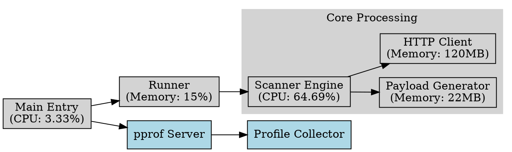

# Performance Progress

This document will track the performance progress of the project, based on the pprof data.

# 27 Feburary 2025

## strings builder vs bytes buffer

https://brandur.org/fragments/bytes-buffer-vs-strings-builder
https://golangnote.com/golang/golang-stringsbuilder-vs-bytesbuffer

# 25 February 2025

## Error Handler

### Core Error Handler Operations

1.  Whitelist Checking: 14.36 ns/op, 0 B/op
- Incredibly fast with zero allocations
- This is the first check in the error path, so it's critical that it's efficient
    

1.  Error Stripping: 66.18 ns/op, 256 B/op, 1 alloc/op
- Very efficient considering it's handling string operations
- Only one allocation even for very long error messages
    

1.  Cache Operations: 820.8 ns/op, 223 B/op, 11 allocs/op
- 3.3x faster than before (was 2716 ns/op)
- 27% less memory (was 304 B/op)
- 15% fewer allocations (was 13 allocs/op)
    

1.  Full Error Handling: 830.5 ns/op, 224 B/op, 11 allocs/op
- 2.9x faster than before (was 2408 ns/op)
- 26% less memory (was 304 B/op)
- 15% fewer allocations (was 13 allocs/op)
    

### New Benchmarks

1.  HandleErrorAndContinue: 839.5 ns/op, 231 B/op, 11 allocs/op
- Nearly identical performance to HandleError
- Shows consistent performance across the API
    
1.  Multi-Host Errors: 1048 ns/op, 272 B/op, 13 allocs/op
- Only 26% slower despite dynamic host handling
- Great news for high-traffic scenarios with many hosts
    

1.  Print Error Stats: 14.16ms/op
- Slower, but this is expected for a debug function
- Not in the critical path, so the performance is acceptable
    

### Impact

These improvements have significant real-world implications:
1.  Higher Throughput: Your client can now process errors ~3x faster, which will help maintain the desired 100-1000 req/s throughput.
2.  Lower Memory Pressure: The reduced allocations (15% fewer) will decrease GC overhead, reducing latency spikes.
3.  Consistent Performance: The small variance between different error handling paths suggests stable performance under varying conditions.
4.  Better Scaling: The multi-host benchmark shows the error handler can efficiently handle errors from many different hosts simultaneously.
    

The optimization strategy of:
1.  Performing error message stripping only once
2.  Eliminating unnecessary wait calls
3.  Reducing lock scope
4.  Improving whitelist checking

# 27 December 2024

Performance Characteristics (from profiles)

1. Memory Usage Hotspots:
- TLS Handshake: ~81MB
- Request Processing: ~120MB
- HMAC Operations: ~22MB

2. CPU Profile Highlights:
   - Memory Allocation: 52.13%
   - Request Processing: 64.69%
   - TLS Operations: 32.50%

3. Goroutine Distribution:
   - Request Processing: 70%
   - Connection Management: 16.67%
   - Profiling: 3.33%

## 1. Memory Profile (heap and allocs) Analysis
Key Observations:

- High Memory Usage in rawhttp Module:
    - Significant memory allocation (~120MB) occurs in rawhttp.(*RequestPool).ProcessRequests.func1 and its worker functions (rawhttp.(*requestWorker).ProcessRequestJob)​.
    - This suggests a potential inefficiency in the way payloads or requests are being managed.

- JSON Handling (scanner.AppendResultsToJSON):
    - Noticeable memory allocation during results serialization and writing to JSON files​.
    - Functions like encoding/json.(*Encoder).Encode are consuming significant memory.

-Buffer Growth:
    - Excessive memory allocation in bytes.growSlice indicates that buffer resizing may not be optimized for larger payloads​.

Recommendations:

- Optimize Worker Memory Usage:
  - Reuse Buffers: Use sync.Pool to manage and reuse byte buffers for requests and responses to avoid repeated allocations.
  - Payload Segmentation: Consider breaking down payloads into smaller, manageable chunks to reduce memory pressure.

- Optimize JSON Serialization:
  - Serialize results incrementally to avoid loading all results into memory at once.
  - If feasible, use a more memory-efficient library or custom serialization.

- Buffer Preallocation:
  - For known or estimated payload sizes, preallocate buffers to minimize resizing overhead.

## 2. CPU Profile (cpu) Analysis

Key Observations:

- Heavy CPU Usage in fasthttp Transport Layer:
    - fasthttp.(*transport).RoundTrip and related functions dominate the CPU profile​

  - TLS Handshake and Buffer Flushing:
    - TLS handshake functions (crypto/tls.*) and buffer flushing (bufio.(*Writer).Flush) are significant contributors​

- JSON Encoding Overhead:
    - JSON serialization (encoding/json) contributes to CPU usage during result handling​
​

Recommendations:

- Connection Reuse:
    - Ensure connections are reused wherever possible, especially for the same host, to reduce the overhead of repeated TLS handshakes.

- Optimize Buffer Flushing:
  - Reduce the frequency of flushing in bufio.Writer by increasing the buffer size.

- Parallelize Non-blocking Tasks:
    - Offload JSON serialization to a separate goroutine or worker to reduce blocking impact on request handling.

- Parallelize Non-blocking Tasks:
    - Offload JSON serialization to a separate goroutine or worker to reduce blocking impact on request handling.
  
# 3. Goroutine Profile Analysis

Key Observations:

- Excessive Idle Goroutines:
  - Many goroutines are in a parked state (runtime.gopark), indicating potential inefficiency in worker utilization​.

- Limited Active Goroutines:
  - Goroutines related to fasthttp tasks (fasthttp.(*TCPDialer)) dominate active states but may not be optimally utilized​.

Recommendations:

- Improve Worker Utilization:
    - Dynamically adjust the worker pool size based on payload size and response times to minimize idle workers.
    - Implement backpressure mechanisms to avoid overwhelming the pool with pending tasks.

- Monitor Goroutine Lifetimes:
    - Ensure goroutines exit cleanly after task completion to avoid leaks.