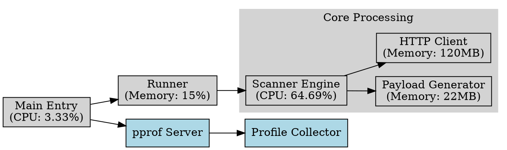

# Performance Progress

This document will track the performance progress of the project, based on the pprof data.

# 2024-12-27

Performance Characteristics (from profiles)

1. Memory Usage Hotspots:
- TLS Handshake: ~81MB
- Request Processing: ~120MB
- HMAC Operations: ~22MB

2. CPU Profile Highlights:
   - Memory Allocation: 52.13%
   - Request Processing: 64.69%
   - TLS Operations: 32.50%

3. Goroutine Distribution:
   - Request Processing: 70%
   - Connection Management: 16.67%
   - Profiling: 3.33%

